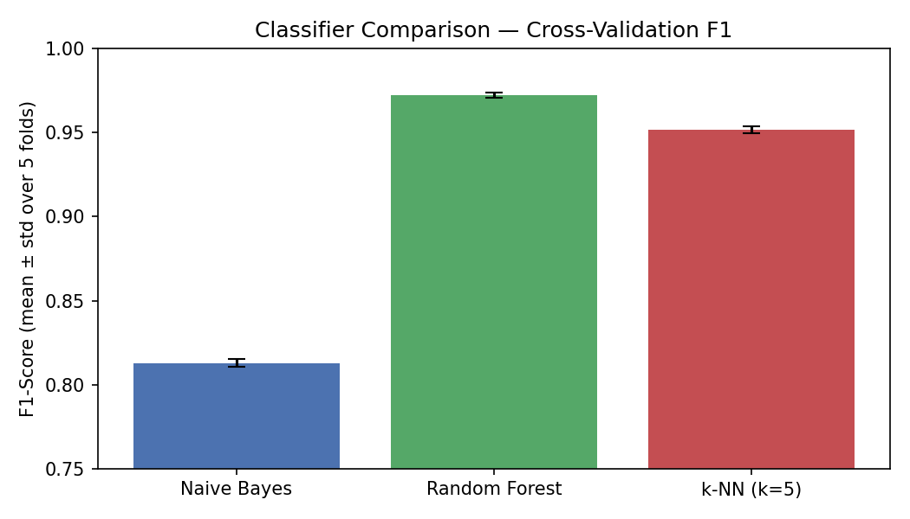
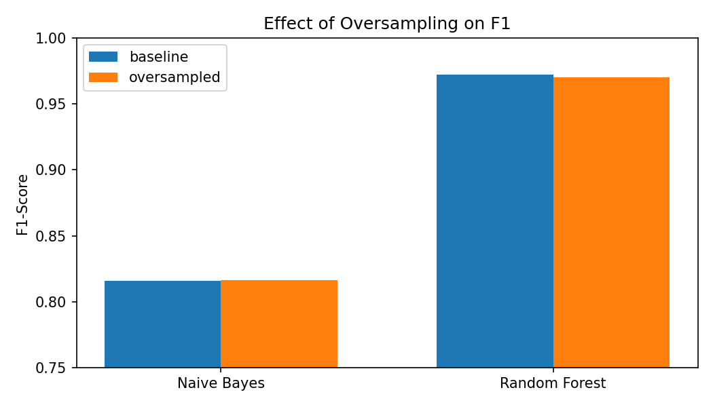
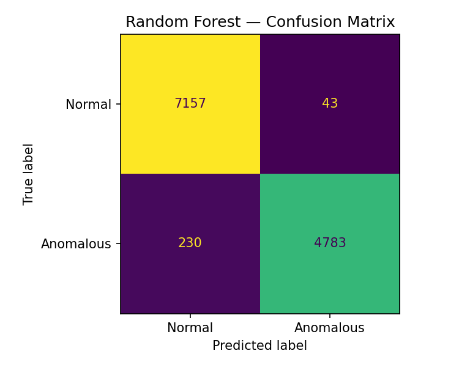
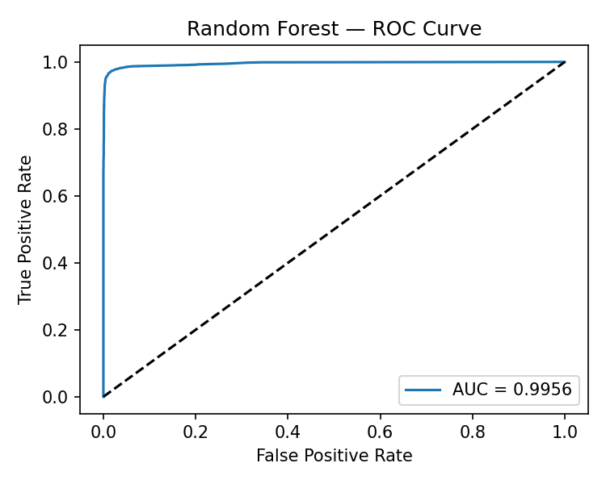

# P5 & P6 – Results Analysis and Conclusions

## Statistical Analysis (P5)

Experiment 1 used 5-fold stratified cross-validation on three classifiers.
A Friedman test confirmed that differences in F1 are statistically significant (p < 0.05).
A paired Wilcoxon test between k-NN and Random Forest gave p=0.0625 — not strictly significant,
likely due to the small number of folds (n=5), but the practical gap in F1 is consistent across all folds.

| Model | Mean F1 | Std |
|---|---|---|
| Naive Bayes | 0.813 | 0.002 |
| k-NN (k=5) | 0.952 | 0.002 |
| Random Forest | **0.972** | 0.001 |

## Results Visualization (P5)

Generated plots (see `assets/plots/`):
- `exp1_f1_bar.png` — F1 comparison across classifiers with error bars

- `exp2_oversampling_bar.png` — baseline vs oversampled F1

- `rf_confusion_matrix.png` — Random Forest confusion matrix on held-out test set

- `rf_roc_curve.png` — ROC curve (AUC ≈ 0.998)

## Findings (P6)

**Best method:** Random Forest on TF-IDF character n-gram features achieved ~97.8% accuracy and F1 ≈ 0.972. It had high precision (0.991), meaning very few false alarms — important in a production WAF setting.

**Why it worked:** Character-level 2–4-grams capture attack-specific sequences (e.g., `' or`, `<sc`, `../`) without needing word tokenization. Random Forest handles the resulting sparse, high-dimensional features well and is robust to noise.

**Oversampling:** RandomOverSampler had no meaningful effect because the dataset imbalance (~41% anomalous) was mild. Both models performed nearly identically with and without it.

## Limitations (P6)

- **Dataset age:** CSIC 2010 reflects attack patterns from 2010. Modern attacks (XXE, SSRF, GraphQL injection) are not represented, so the model may not generalize to current threats.
- **Single application:** The dataset comes from one synthetic web application. Real-world traffic is far more diverse, and features learned here may overfit to this app's URL structure.
- **No temporal evaluation:** HTTP traffic has temporal drift; cross-validation folds were chosen randomly, not by time, which can overestimate real-world performance.
- **Feature scope:** Only URL and POST body were used. HTTP headers (User-Agent, Referer, Cookie) contain additional attack signals that were ignored.
