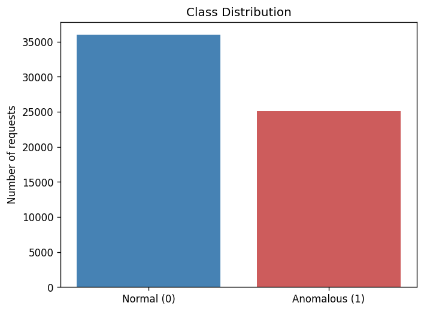
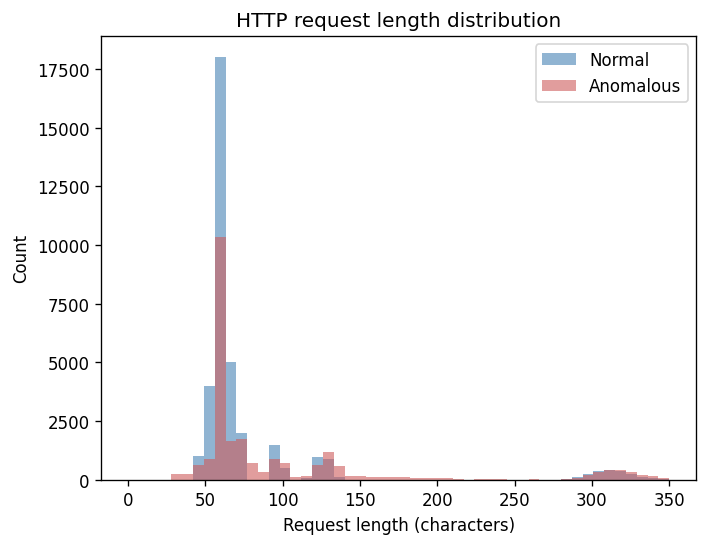
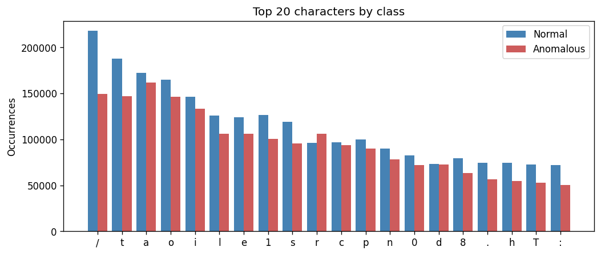

# Problem Definition

## Task
Binary classification of HTTP requests from the **CSIC 2010** dataset.
For each incoming request `x`, predict a label `y ∈ {0, 1}`:

- **0 – Normal:** benign traffic produced by ordinary user behavior.
- **1 – Anomalous:** request containing an attack vector (SQL injection, XSS,
  path traversal, buffer overflow, etc.).

## Dataset
- 61 065 labeled HTTP requests, single CSV file (`assets/csic_database.csv`).
- Each row holds HTTP method, headers, content, and the full request line.

### Class Distribution
- 36 000 Normal (≈59 %) / 25 065 Anomalous (≈41 %).
- Mild class imbalance — Normal samples dominate but Anomalous is not rare.

### Request Length
Anomalous requests tend to be longer (more payload data in attacks), while normal requests are typically shorter.

### Character Patterns
Character frequencies differ between normal and anomalous traffic. Attack payloads introduce distinctive characters (e.g., SQL operators, encoding symbols).

## Goal
Learn a function that maximizes detection of anomalous requests
while keeping false positives on normal traffic low.

## Evaluation Metrics
Because the dataset is imbalanced and false negatives are more costly than
false positives in a security context, accuracy alone is insufficient.
The following metrics will be reported:

- **Accuracy** – overall correctness.
- **Precision** – fraction of predicted attacks that are real attacks.
- **Recall** – fraction of real attacks that we catch.
- **F1-score** – harmonic mean of precision and recall.
- **Confusion matrix / ROC curve** for visual analysis.

## Assumptions
- Each request is classified independently (no session-level context).
- The label provided in the dataset is treated as ground truth.
- Only features extractable from the raw HTTP request are used (no external
  threat intelligence).
